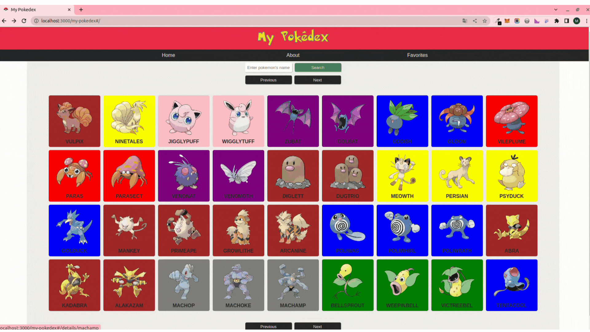
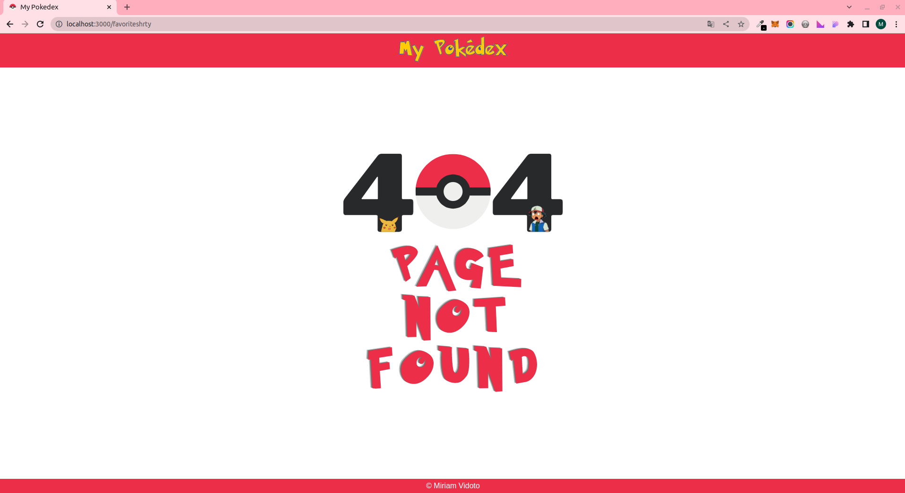

# My Pokedex

Projeto para o desafio técnico, onde foi desenvolvido uma Pokédex (ferramenta para buscar e exibir informações de pokémons).
Foi um projeto muito divertido de desenvolver, no qual pretendo continuar trabalhando para aprimorar seu design e suas funcionalidades.

- https://miriamvidoto.github.io/my-pokedex/

## Desafio

Requisitos funcionais:

- Consumir os dados dos pokémons da API;

- Exibir os pokémons com a imagem e o nome em formato de grid;

- Ao clicar no pokémon, deverá ser exibido mais detalhes do pokémon;

### Passo a passo para acesso da aplicação:
1. Clone o repositório
  ``git clone git@github.com:MiriamVidoto/my-pokedex.git``

2. No repositório clonado, instale as dependências do projeto:
  ``npm install``

3. Inicie o app para visualização da página e acesse através da porta 3000:
  ``npm start``
  

## Desenvolvimento:
- Projeto de Front-end de uma aplicação para pesquisa e exibição das informações de pokémons. 

- Desenvolvido com React.js, utilizando React Router, React Hooks e Context API.

- Foi ulizado RTL( react-testing-library ) e Jest para implementação de testes.

- A estilização foi feita com 'CSS-IN-JS' com a biblioteca styled-components.

- Integração com a API de pokemons [PokéApi](https://pokeapi.co/)

### Funcionalidades da aplicação:
Ao utilizar a aplicação, o usuário é capaz de:

  - Na página inicial, visualizar os Cards de cada pokémon;

  

  - Realizar a busca de pokémons pelo nome;

  

  - Adicionar ou remover os pokémons escolhidos pelo usuário aos favoritos;

  

  - Acessar a página de detalhes clicando no card de cada pokémon.

  

### Desafios da aplicação:

  - Complexidade da Api com muitos endpoints e informações.
  
  

###### Projeto desenvolvido por: [Miriam Vidoto](https://github.com/MiriamVidoto)
